# Employee Management API

## Overview

Employee Management API is a backend Web API built using ASP.NET Core.  
It provides secure and scalable endpoints to manage employees with full CRUD functionality.

The system follows clean architecture principles using Controller -> Service -> Repository pattern and includes JWT authentication, validation, and global exception handling.


## Features

### Core Features
- Create employee with validation
- Get all employees
- Get employee by ID
- Update employee details
- Delete employee
- Search employees (name, department, designation)
- Unique email validation

### Security Features
- JWT Authentication
- Protected endpoints using `[Authorize]`
- Secure token-based access

### System Features
- Global exception handling
- Structured logging with Serilog
- Swagger API documentation
- Clean layered architecture


## Tech Stack

### Backend
- ASP.NET Core (.NET 8)
- Entity Framework Core
- SQL Server
- JWT Authentication
- Serilog (Logging)
- Swagger


## Architecture

- Controller → Service → Repository → DbContext → Database
- Separation of concerns
- Dependency Injection used throughout


## Project Structure

### EmployeeManagement.API
- Controllers
- Services
- Repositories
- Models
- DTOs
- Data
- Middleware
- Program.cs
- appsettings.json


## Employee Data Model

### Mandatory Fields
- fullName
- email
- phoneNumber
- designation
- department
- dateOfJoining
- status

### Optional Fields
- location
- salaryBand

### Auto Generated
- employeeId (Primary Key in DB)


## API Endpoints

### Auth

| Action | Method | Endpoint |
|--------|--------|----------|
| Login | POST | /api/auth/login |


### Employees

| Action | Method | Endpoint |
|--------|--------|----------|
| Create Employee | POST | /api/employees |
| Get All Employees | GET | /api/employees |
| Search Employees | GET | /api/employees?search= |
| Get Employee By ID | GET | /api/employees/{id} |
| Update Employee | PUT | /api/employees/{id} |
| Delete Employee | DELETE | /api/employees/{id} |


## Authentication

### Login Request

```json
{
  "username": "admin",
  "password": "password"
}
```

### Login Response

```json
{
  "token": "jwt_token"
}
```

### Usage
- Add token in request header:

    - `Authorization: Bearer jwt_token`

### Sample Request (Create Employee)

```json
{
  "fullName": "John Doe",
  "email": "john.doe@example.com",
  "phoneNumber": "9876543210",
  "designation": "Software Engineer",
  "department": "IT",
  "dateOfJoining": "2024-01-15",
  "status": "Active",
  "location": "Chennai",
  "salaryBand": "Band 3"
}
```
## Validation
- Backend Validation (Data Annotations)
- Required fields
- Email format validation
- String length restrictions

## Exception Handling

- Global exception handling is implemented using middleware.

- Handled Exceptions
    - NotFoundException → 404
    - BadRequestException → 400
    - Unhandled Exception → 500

## Logging

- Logging is implemented using Serilog:

    - Console logging
    - File logging (logs/employeeapi-.log)
    - Error tracking

## Swagger Documentation

- Swagger UI available at:

    - `https://localhost:<port>/swagger`

- Features:

    - Test APIs directly
    - Add JWT token via Authorize button
    - View request/response models

## Setup Instructions

1. Configure Database

Update appsettings.json:

```json
{
  "ConnectionStrings": {
    "DefaultConnection": "Server=localhost;Database=EmployeeDb;Trusted_Connection=True;TrustServerCertificate=True"
  }
}
```

2. Run Migrations

    - `dotnet ef migrations add InitialCreate`

    - `dotnet ef database update`

3. Run Application

    - `dotnet run`


## Screenshots

### Swagger UI
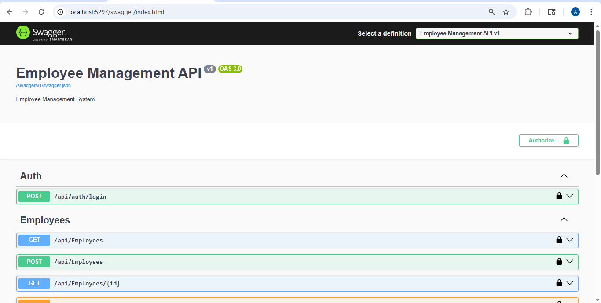

### Unauthorized Access
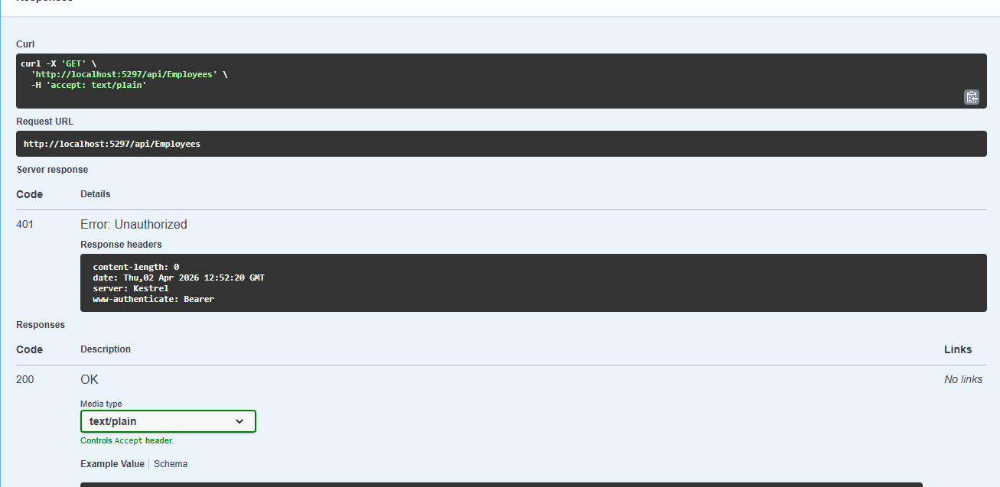

### Login API
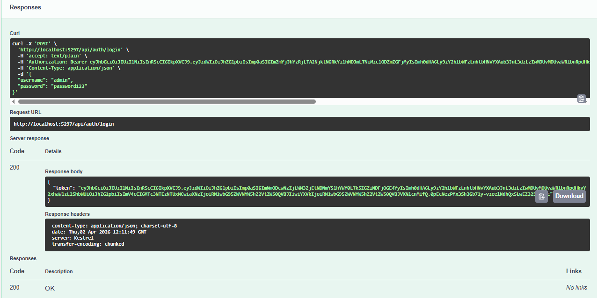

### Get Employees
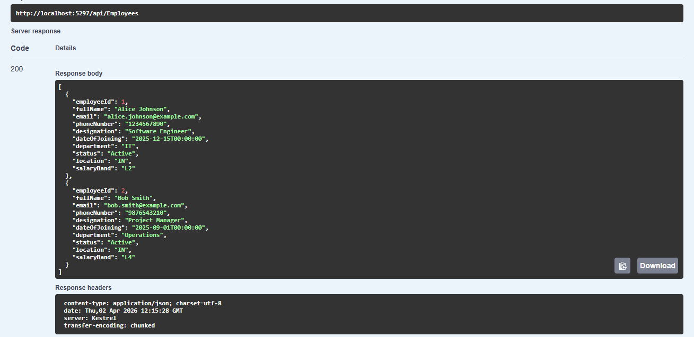

### Get Employee by Id
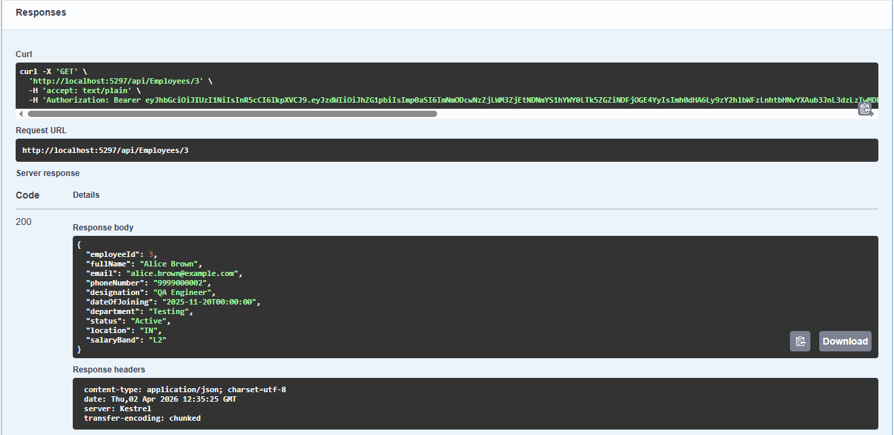

### Employee Not Found Exception
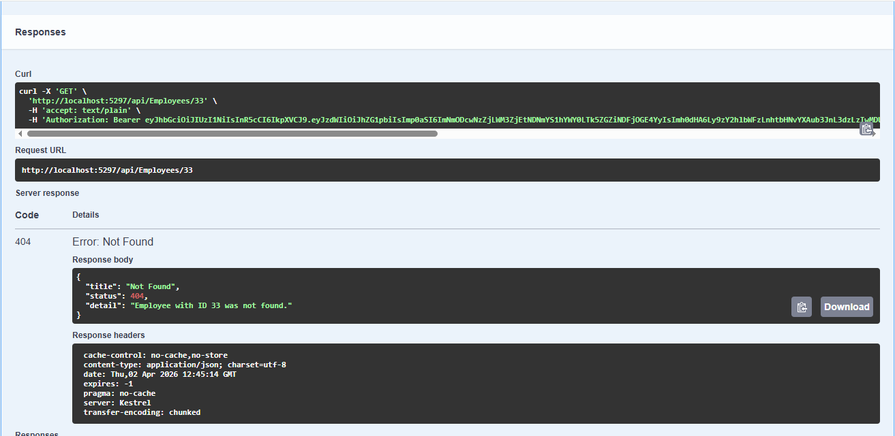

### Create Employee
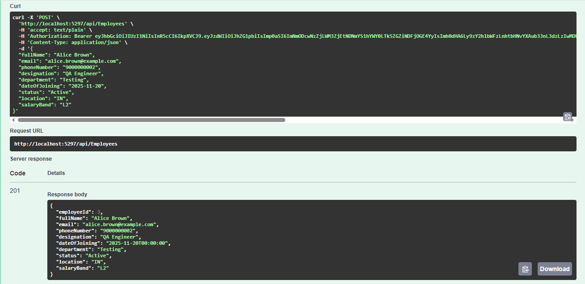

### Update Employee
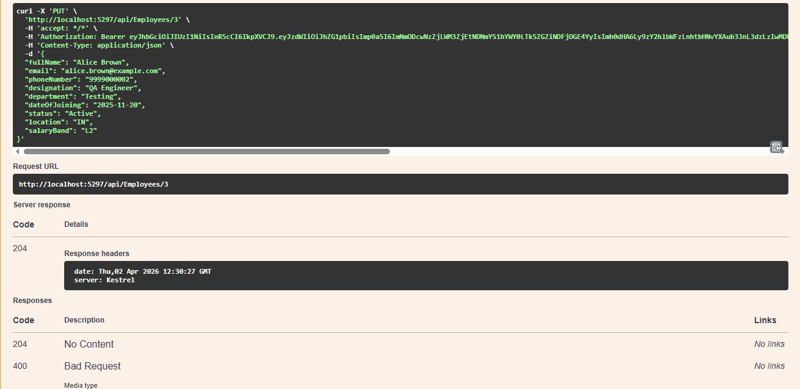

### Validation
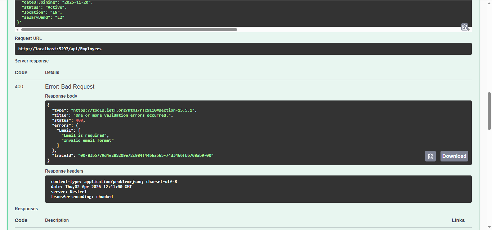

### Duplicate Email
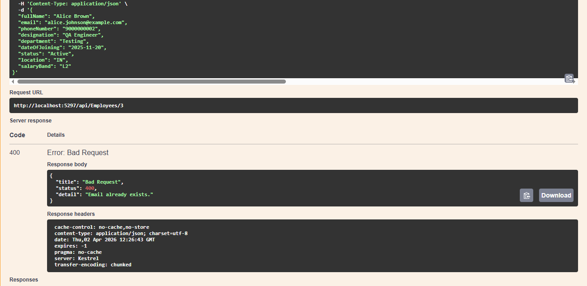

### Search Employee
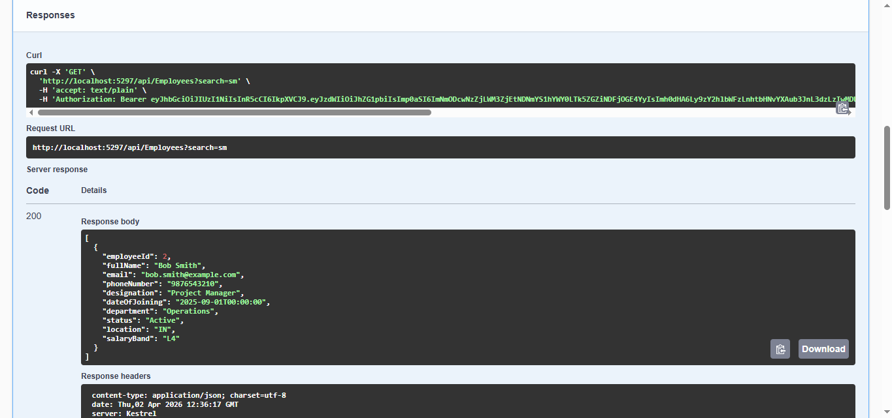

### Delete Employee
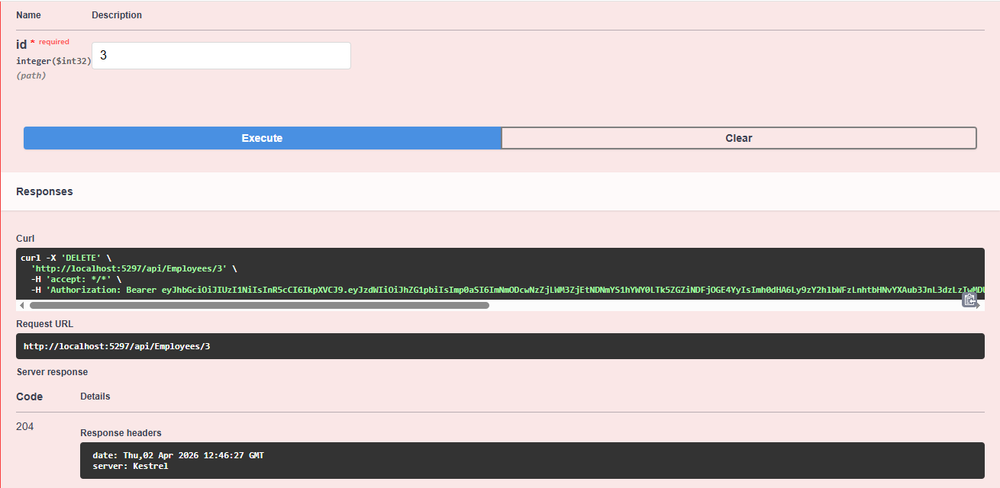

### Database Table
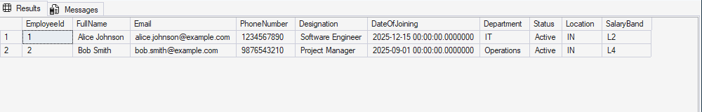
